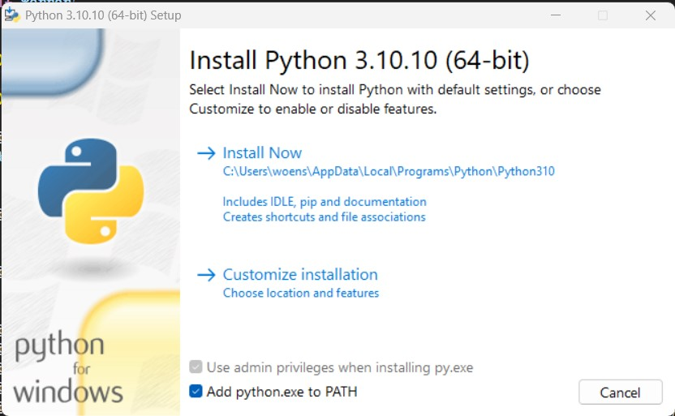
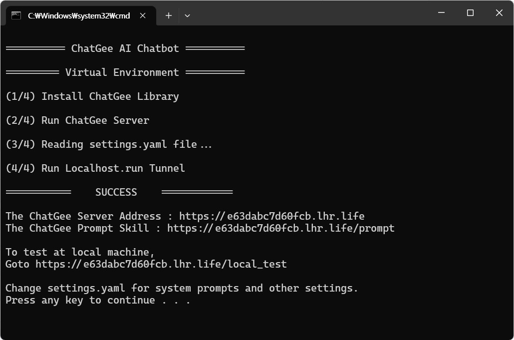

# ChatGee(챗지) AI 챗봇 

카카오톡 AI 챗봇 챗지 개발 라이브러리

- **챗지 챗봇의 성격, 역할, 내용을 프롬프트로 직접 디자인 가능**
- 기본 포함기능
  - 사용설명서 카드페이지 표시 `사용설명서`
  - 대화내용 삭제 기능 `새로운 시작`
- 카카오톡 채널이 요구하는 5초내 응답조건 대응
  - 5초 내 응답하지 못하면 '생각중'이라는 답을 우선 송신
  - 사용자가 다시 요청 시, DB에 저장된 답변을 송신
- ChatGPTers의 AI 챗봇 개발실과 함께합니다
  - [AI 챗봇 개발실 (ChatGPTers)](https://open.kakao.com/o/gECQhjbf)

> 카카오톡 챗봇 등록에 시간이 최대 6일 소요됩니다. [채널 신설과 챗봇 등록](https://github.com/woensug-choi/ChatGee/tree/main/docs/kakao_channel)을 우선 수행해 두시기 바랍니다!

> 5초 후 응답하려면 '광고'의 성격을 가지므로 15원이 소모

# 개발 예제

| [챗지 벤치마크](http://pf.kakao.com/_RxoCkxj/chat) | [챗지 성경공부](http://pf.kakao.com/_FmUkxj/chat) | [챗지 상품소개](http://pf.kakao.com/_BCjxmxj/chat) | 
| --- | --- | --- |
|  |  |  |

# 설치방법

- [초급자용](#초급자용-설치방법) : 윈도우 Batch 실행 파일 `ChatGee.bat`
  - `settings.yaml`에서 챗지 성격, 역할, 내용 디자인
  - Python 및 필수 라이브러리 자동설치
  - ChatGee 서버 구동 (Flask)
  - Localhost.run를 이용한 서버 고정주소 자동 발급 
- [개발자용](#채발자용-사용방법) : Flask 앱 `chatgee/run_server.py` 
  - `settings.yaml`에서 챗지 성격, 역할, 내용 디자인
  - Flask 내 Threading/Queue 그대로 `uwsgi` 사용가능

## 초급자용 설치방법

- 설치순서
  - [1. 소스코드 다운로드](#1-소스코드-다운로드)
  - [2. 파이썬 설치](#2-파이썬-설치)
  - [3. Settings.yaml 설정](#3-settingsyaml-설정)
  - [4. ChatGee.bat 실행](#4-chatgeebat-실행)
  - [5. 응답내용 테스트](#5-local_test-에서-챗봇-응답내용-테스트)
  - [6. 카카오톡 채널/챗봇 등록](#6-카카오톡-채널-신설-및-챗봇-등록)

#### 1. 소스코드 다운로드
- ChatGee(챗지) Github 레포지토리에서 최신 릴리즈 다운로드
  - [최신 릴리즈 다운로드 링크](https://github.com/woensug-choi/ChatGee/releases)
  - 원하는 곳에 압축을 풀고 먼저 Python을 설치

#### 2. 파이썬 설치
- 동봉된 `python-3.10.10.exe` 또는 직접 파이썬 홈페이지에서 3.10.10 설치파일을 받아 설치
- (주의사항!!) 아래 스크린샷과 같이 아래 `Add python.exe to PATH` 클릭 필수!

  

#### 3. `Settings.yaml` 설정
- 필수 설정 항목
  - OpenAI API Key
    - `Settings.yaml > OPEN_AI > YOUR_OPEN_AI_API_KEY` 에 본인의 API Key를 입력
    - OpenAI 가입 후 API Key를 발급받아 입력하며 됩니다. `sk-복잡한영문키`의 형태
  - 챗지 챗봇의 성격, 역학 내용을 정하는 시스템 프롬프트
    - `settings.yaml > SETTINGS > SYSTEM_PROMPT`에 챗지 챗봇을 정의하는 설명 기입
      - 동본된 `SYSTEM_PROMPT`는 챗지가 영문번역기가 되도록 정의되어 있음
      - 한글로도 기입가능하지만 영문일 때 컨트롤이 더 잘됨
      - 어떤 역할들이 가능한지는 [Awsome Prompts](https://github.com/f/awesome-chatgpt-prompts#prompts)를 참고
      - 역할을 부여할 때, `ChatGee는 무엇무엇을 한다`로 정의
  - 첫 사용자에게 보여지는 인사말
    - `settings.yaml > CONTENTS > GREETINGS`에 기입
  - 후원금 링크
    - `settings.yaml > CONTENTS > SUPPORT_LINK`에 기입
    - 빈칸으로 두면 후원금 링크는 보여지지 않음
  - 사용설명서 두번째 페이지
    - `settings.yaml > CONTENTS > EXPLAIN`에 기입
    - 챗지 사용설명서 두번째 페이지에 기입될 내용
    - 기본적인 챗지 사용설명서는 함께 동봉됨
  - 광고 또는 주기적 알림 내용
    - `settings.yaml > CONTENTS > ADVERTISEMENT`에 기입
    - `settings.yaml > CONTENTS > ADVERTISEMENT_FREQUENCY`에서 정의된 주기로 등장
  - 채널 친구가 아닌 상태에서 사용가능 횟수
    - `settings.yaml > CONTENTS > NO_FRIEND_USE_LIMIT`에서 정의

#### 4. `ChatGee.bat` 실행
- ChatGee의 소스코드에서 `ChatGee.bat`을 더블클릭으로 실행
- 실행이 완료되면, Localhost.run이 발급한 주소로 접속
- `https://이상한영문.lhr.life`
  - 챗지 챗봇의 기본 서버 주소
- `https://이상한영문.lhr.life/prompt`
  - 끝에 `prompt`가 붙은 주소가 카카오톡 서버와 주고받을 주소
- `https://이상한영문.lhr.life/local_test` 
  - 끝에 `local_test`가 붙은 주소가 카카오톡 서버를 거치지 않고 시스템 프롬프트에 따른 응답내용을 확인할 수 있는 테스트 주소
- 실행되는 순서
  - Python 및 필요 라이브러리 설치확인
  - ChatGee 서버 구동 (Flask)
  - Localhost.run를 이용한 서버 고정주소 자동 발급 
  
    

#### 5. `/local_test` 에서 챗봇 응답내용 테스트
- `ChatGee.bat` 실행에서 얻은 ``https://이상한영문.lhr.life/local_test`로 `local_test`로 끝나는 주소로 접속
- 사용자가 입력할 내용을 빈칸에 입력 후 `Submit`을 클릭 또는 엔터를 입력하면, 응답소요시간, 응답내용을 확인 가능

#### 6. 카카오톡 채널 신설 및 챗봇 등록
> 카카오톡 챗봇 등록에 시간이 최대 6일 소요됩니다. 카카오톡 채널 신설 및 챗봇 등록을 우선 수행해 두시기 바랍니다!

- [카카오톡 채널 신설 및 챗봇 등록 매뉴얼](https://github.com/woensug-choi/ChatGee/tree/main/docs/kakao_channel)

## 개발자용 사용방법

저도 이번에 처음 Flask, Queue/Threading을 사용한 병렬처리 방법 등 공부하면서 만든 코드여서 기존의 개발자들이 보시면 많이 어렵지 않을 거라고 생각됩니다!

PR은 언제나 환영입니다! 네이버 라인, GPT 4, 다른 AI 모델들을 접목하는 기능이 쉽게 추가될 수 있도록 고려해 작성해 두었습니다!

현재 운영되고 있는 챗지 카카오톡 채널은 본 코드를 베이스로 `검색기능`, `질문 추천기능` `대화모드 설정기능`, `OCR`, `기타기능`이 추가된 벤치마크 챗봇입니다. 해당 챗봇은 벤치마크 모델로서 지속가능한 형태로의 최소한의 수익만을 목표로 하며, 기타 다른 광고, 세미나 등으로 본 오픈소스를 키워가면 좋겠다고 생각합니다. 함께 채널을 운영하고 코드를 키워나가실 분은 언제나 환영입니다!

## 라이센스 정보
- `BSD 4-Clause "Original" or "Old" License` 라이센스
  - 상업적 사용 가능
  - 수정, 배포 가능
  - 다만!, 본 ChatGee 라이브러리가 사용되었음을 모든 광고물 및 수정, 배포, 상업판에 표기 필수
- [라이센스 정보 확인](https://github.com/woensug-choi/ChatGee/blob/main/LICENSE)

## 후원
- [후원링크](https://qr.kakaopay.com/Ej87lce5z9c408045)

## Contact
- 제휴 문의 : talkchatgpt@gmail.com