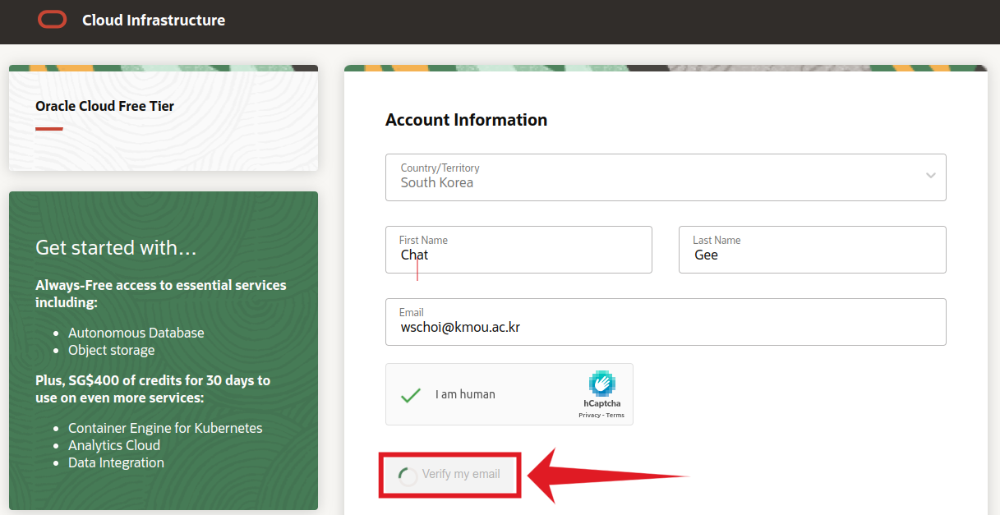
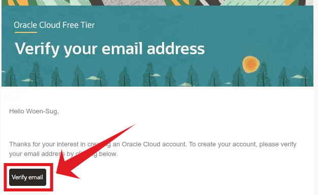

- [오라클 클라우드 평생무료 인스턴스 설정](#오라클-클라우드-평생무료-인스턴스-설정)
  - [오라클 클라우드 회원가입](#오라클-클라우드-회원가입)
  - [오라클 클라우드 로그인](#오라클-클라우드-로그인)
  - [오라클 클라우드 서버생성](#오라클-클라우드-서버생성)
  - [오라클 클라우드 서버 접속](#오라클-클라우드-서버-접속)
  - [오라클 클라우드 개발환경 설정](#오라클-클라우드-개발환경-설정)


워크샾 참여를 환영합니다 🥳🎉
본 페이지는 직접 주소를 입력해 접속해야만 보실 수 있습니다!

> **📢 본 내용을 수행해두지 않으면 워크샾 시간 내 챗봇은 완성할 수 없습니다**
> 
> **문의사항은 '워크샾 참여 멤버 오픈톡방'에서 문의해 주시기 바랍니다**
> - 워크샾 참여멤버 실전방 오픈톡방 : [접속링크](https://open.kakao.com/o/goF68Ssf) (비밀번호 : `chatgee`)

## 오라클 클라우드 평생무료 인스턴스 설정

- 서버가 상시구동 되기 위한 온라인 컴퓨터로써 오라클 클라우드를 설정합니다
  - 오라클 클라우드 평생무료
    CPU코어 1개의 클라우드 컴퓨터를 2대까지 무료로 무기한으로 제공

### 오라클 클라우드 회원가입

- Step 1-1 <a href="https://www.oracle.com/kr/cloud/" target="_blank"> 오라클 클라우드 사이트 페이지 https://www.oracle.com/kr/cloud/</a> 에서 로그인 페이지 이동


- Step 1-2 회원가입 진행


- Step 1-3 메일주소 확인요청



- Step 1-4 본인 메일에서 수신메일 검증 버튼 클릭



- Step 1-5 넘어간 페이지에서,
  - Cloud Account Name : `계정이름`
  - Home Region : 한국(춘천) 서버
  
  - `여기서 설정한 계정이름은 로그인에 사용`!

- Step 1-6 체크박스 모두 동의 후 다음페이지 이동


- Step 1-7 넘어간 페이지에서,
  - `주소/전화번호 입력` (자세하진 않아도 정확해야 합니다)


- Step 1-8 다음으로 `신용카드 정보 등록` : 무료서버만 사용할 예정이나, 회원가입엔 신용카드정보가 필요
  - 신용카드 입력 중 문제가 생기면, 뭔가 꼬여서 고객센터 연락하라고 합니다. 이경우, 5분이상 후에 다시 메일에 온 메일인증 버튼 단계부터 다시 시도


- Step 1-9 신용카드 등록이 완료되면 `동의 체크박스 클릭` 후 회원가입 완료버튼 클릭
  - 자동으로 넘어간 페이지에서 기다리시면 오라클 로그인 페이지로 자동으로 넘어갑니다.


### 오라클 클라우드 로그인

- Step 2-1 앞서 설정한 `로그인용 계정이름`으로 로그인을 시작합니다.


- Step 2-2 다음으로 `메일주소`와 `비밀번호`로 최종 로그인합니다.


- Step 2-3 처음 로그인을 시도하면 `Secure Verification (보안인증)` 설정 페이지가 나타납니다
  - 클라우드 서버 계정을 해킹해 좀비피씨로 몇백~몇천만원어치 사용하는 경우가 빈번히 있었던 시절 이후 대부분 보안인증을 요구합니다.

- Step 2-4 버튼을 눌러 넘어가시면 `QR코드`가 나옵니다.
  - 앱스토어 또는 구글스토어에서 `Oracle Mobile Authenticator` 를 검색해 핸드폰에 설치하고 앱을 실행후 `계정추가(Add Account)`를 진행하면 나타나는 카메라로 QR코드를 인식하면 나오는 보안 OTP 번호로 보안인증을 수행합니다.
  - 완료후 다시 로그인합니다


- 로그인에 성공하면 다음과 같은 Dashboard 화면이 나옵니다.


### 오라클 클라우드 서버생성

  - 대쉬보드에서 먼저 오른쪽 위 지구본 버튼으로 한글로 변경합니다.
- 로그인에 후 대쉬보드에서 `인스턴스 컴퓨트`를 클릭해 이동합니다.


- 인스턴스 컴퓨트 페이지에서 먼저 왼쪽아래 `구획`에서 계정을 선택합니다.
- 그러면 `인스턴스 생성` 버튼이 보입니다. 클릭합니다.


- `인스턴스 이름`을 설정합니다.


- `이미지 및 구성` 항목의 `편집`을 클릭합니다.
- 기본 `평생무료` 이미지는 Standard E2.1.Micro라고 하는 일반 CPU의 코어 1개로 되어있습니다. 코어 1개는 아무래도 사용성이 떨어지니 새로 나온 ARM기반의 CPU 4개짜리로 변경하려합니다.
  - 이부분에서, CPU 4개짜리 ARM 인스턴스는 인기가 많아 마지막에 생성이 안되는 경우가 있습니다. 그런경우 다른 시간에 여러번 시도해서 뚫어놓으시면 좋습니다. 정말 안된다면, 기존의 Standard E2.1.Micro로 생성해 주시기 바랍니다. 다음 페이지에 이어서  CPU 4개짜리 ARM 설정방법을 설명합니다.


- `Change Shape`을 클릭해 인스턴스의 종류를 변경하는 페이지로 이동합니다.
  


- `Ampere` 타입 선택 후 `Standard.A1.Flex`를 체크합니다.


- `OCPU 수` 를 4로 설정합니다. 그 이상은 무료가 아닙니다.


- 다음으로 네트워킹을 설정합니다. 


- 다음으로 인스턴스에 접속하기 위한 `암호키 (전용키, 공용키 모두!)`를 다운받고 인스턴스를 `생성`합니다.


- 다운받은 암호키는 2개의 파일입니다
  - 전용키 예: `ssh-key-2023-06-08.key`
  - 고용키 예: `ssh-key-2023-06-08.key.pub`

- 로그인 암호가 파일의 형태로 되어있다고 생각하시면 됩니다. `해당 파일들을 분실하시면 만드신 인스턴스에 다시는 접속할 수 없습니다!` 분실하지 않도록 주의하시기 바랍니다!

- 페이지 최하단의 `생성` 버튼을 누르면 인스턴스 상태화면으로 넘어갑니다. `프로비전`(생성 중) 단계를 지나면 왼쪽의 그림 색이 초록색으로 변하며 완료됩니다.

- 여기서 생성한 인스턴스에 접속할 수 있는 `고정아이피`를 확인할 수 있습니다.


### 오라클 클라우드 서버 접속

- VSCode 설치
  - 다운로드 링크 : [https://code.visualstudio.com/download](https://code.visualstudio.com/download)

- 실행 후 '왼쪽 탭에서 `테트리스`(익스텐션) 검색 아이콘 클릭 -> `remote` 검색, `Remote-SSH` 설치


- `Remote-SSH`설치 완료 후 후, 왼쪽 아래 `><`파란버튼 (Remote SSH 연결 버튼) 클릭, `Connect to Host...`선택 후 `Configrure SSH Hosts...` 선택


- 제일 상단의 설정파일경로 선택 (운영체제 마다 경로가 상이)해 설정파일 열기
- 본인의 오라클 서버 `아이피주소`, `다운받은 Key 경로` 입력 (`Host oracle` `User opc`는 공통, `저장필수!!`)


- 설정파일 저장 후, VSCode 창의 가장 왼쪽 아래 코너의 `><`파란버튼 (Remote SSH 연결 버튼) 클릭, `oracle` 을 클릭하면 오라클 서버에 연결된 새로운 VS Code창이 나타남. 
- 새로 나타난 창에서 상단에 `Terminal` -> `New Terimal` 클릭
  


- 최종적으로 나타나는 VSCode 창은 다음과 같은 모습
- 왼쪽 아래에 파란버튼에 `oracle` 확인가능
- 오라클 서버에 접속한 명령어창(Terminal) 확인가능


### 오라클 클라우드 개발환경 설정

- 오라클 서버에 접속한 VSCode 상의 명령어창(Terminal)에서 아래 명령어들을 한줄 씩 순차적으로 입력 + Enter

  - 1 : 리눅스 패키지 목록 업데이트
    ```bash
    sudo dnf update -y
    ```

  - 2 : 파이썬 설치에 필요한 패키지 설치
    ```bash
    sudo dnf install -y curl gcc openssl-devel bzip2-devel libffi-devel zlib-devel wget make sqlite-devel 
    ```

  - 3 : 파이썬 소스코드 다운로드
    ```bash
    wget https://www.python.org/ftp/python/3.10.10/Python-3.10.10.tgz
    ```

  - 4 : 파이썬 소스코드 압축해제
    ```bash
    tar -xf Python-3.10.10.tgz
    ```

  - 5 : 파이썬 소스코드 폴더로 이동
    ```bash
    cd Python-3.10.10
    ```

  - 6 : 파이썬 소스코드 설치환경 설정
    ```bash
    sudo ./configure --enable-optimizations
    ```

  - 7 : CPU4개를 이용해 컴파일 (약 10분 소요됩니다), 코어가 한개라면 마지막 숫자를 `1`로 변경
    ```bash
    make -j 4
    ```

  - 8 : 컴파일한 파이썬을 설치
    ```bash
    sudo make altinstall
    ```

  - 9 : 설치된 파이썬 버전 확인 (Python 3.10.10 으로 나오면 성공입니다.)
    ```bash
    python3.10 --version
    ```

  - 10 : 홈 폴더로 이동
    ```bash
    cd
    ```

  - 11 : 파이썬 소스코드 다운로드파일 삭제
    ```bash
    rm Python-3.10.10.tgz
    ```

